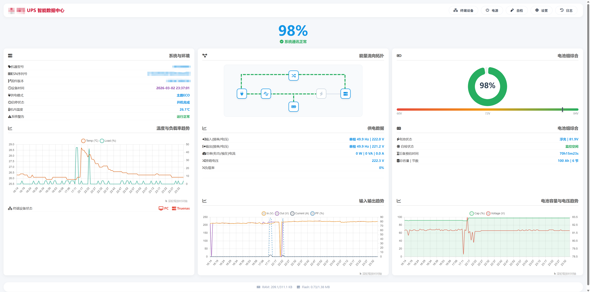
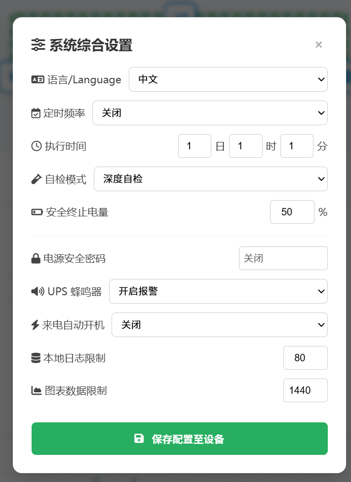
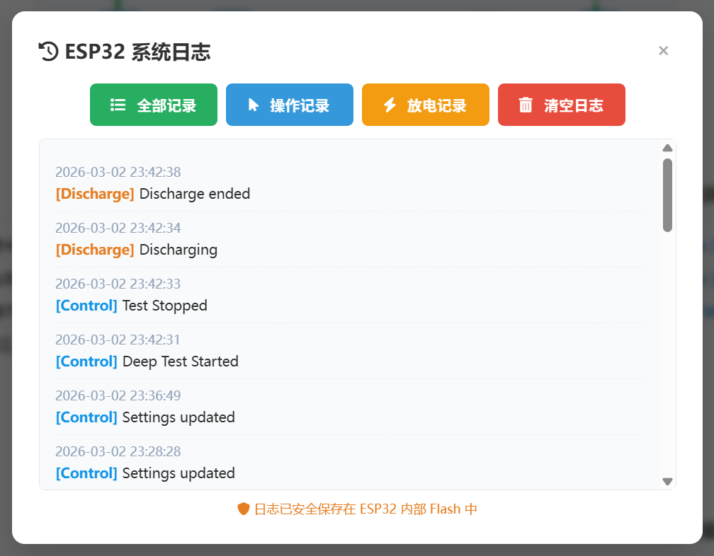
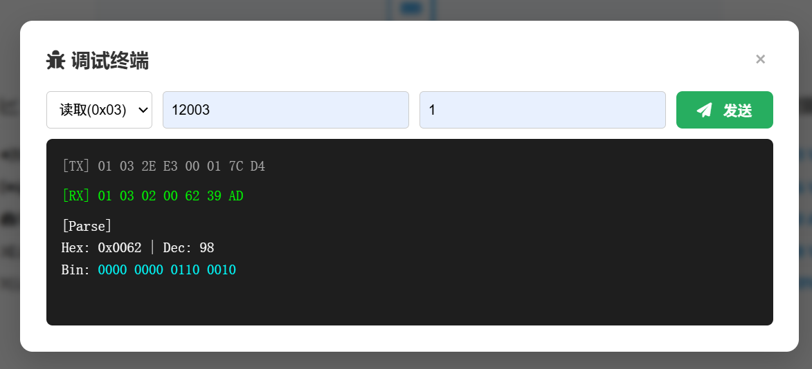

# ESP32 Smart UPS Monitor Gateway / 智能 UPS 监控网关

[**English**](#english) | [**中文**](#chinese)

---

## 📖 Overview
This is a high-performance, embedded Web monitoring gateway designed for Smart Commercial UPS systems (supporting standard Modbus-RTU). Built on the ESP32 microcontroller, it integrates Modbus serial communication, an asynchronous Web server, and a fully responsive HTML5 frontend.

It allows you to monitor UPS status, battery health, and power metrics in real-time, view historic data charts, and even hardware-control the power state of connected PCs via relays—all without relying on external cloud services.

### ✨ Key Features
* **🚀 High-Performance C++ Backend:** Utilizing `ESPAsyncWebServer` for non-blocking, zero-latency Web rendering.
* **📊 Real-time Dashboard & Charts:** Beautiful visualization of power flow, voltage, current, and battery capacity using `Chart.js`.
* **📱 Dual-End Responsive UI:** Dedicated user interfaces for both Desktop (`/`) and Mobile (`/m`) experiences.
* **🛡️ Industrial-Grade Stability:** Built-in FreeRTOS Mutex locks prevent UART data collision. Chunked Response technology ensures zero memory leaks (OOM) when handling large historic datasets.
* **🔌 PC Power Control:** Integrated GPIO relay control to remotely hard-reset or power on your connected servers.
* **🛠️ Built-in Modbus Terminal:** Web-based terminal for direct HEX/Decimal Modbus RTU testing with strict password protection.

### 🧰 Hardware Requirements
1. **ESP32 Development Board**
2. **RS485 to TTL Module (e.g., MAX3485)** (Connected to ESP32 UART2)
3. **DS1302 RTC Module** (For accurate offline timekeeping)
4. **Relay Modules** (Optional, for PC power control)
5. **Commercial UPS** (Supporting Modbus-RTU over RS485)

### 🚀 Installation & Usage
1. Clone this repository and open it in **VSCode + PlatformIO**.
2. Edit `/data/res/conf/config.jsonl` (or your LittleFS data folder) to configure your local WiFi SSID and Password.
3. Click **Build** and **Upload** to flash the firmware to your ESP32.
4. **Crucial Step:** Click **Upload Filesystem Image** in PlatformIO to upload the HTML, CSS, JS, and config files to the ESP32's LittleFS.
5. Open the Serial Monitor (115200 baud rate). Once connected to WiFi, the ESP32 will print its local IP address.
6. Visit `http://<ESP32_IP>` for the Desktop dashboard, or `http://<ESP32_IP>/m` for the Mobile app. Default password is blank.

### 📸 Screenshots

**Desktop Interface**

**Dashboard (CN)**

**Dashboard (EN)**

| **Settings** | **System Logs** |
|  |  |
| **Modbus Debugger** | **HEX Terminal** |
|  |  |

**Mobile Interface**
| Main Dashboard | Bottom Status | Charts |
| :---: | :---: | :---: |
|  |  |  |
| **Settings** | **Logs** | **Debug Terminal** |
|  |  |  |

---

## 📖 项目简介
本项目是一个专为支持标准 Modbus-RTU 协议的某品牌商用智能 UPS 设计的高性能嵌入式 Web 监控网关。基于 ESP32 微控制器，它完美整合了底层串行通讯、异步 Web 服务器以及纯本地托管的现代 HTML5 响应式前端。

你可以通过局域网实时监控 UPS 的运行状态、电池健康度、能量流向拓扑，查看历史曲线，甚至通过继电器远程硬控主机的开关机。所有数据均安全保存在 ESP32 内部 Flash 中，完全脱离外部云端限制。

### ✨ 主要功能
* **🚀 高性能 C++ 后端:** 采用 `ESPAsyncWebServer` 异步框架，网页秒开。
* **📊 实时数据看板与历史曲线:** 结合 `Chart.js`，优雅呈现电压、电流、负载率及电池容量趋势。
* **📱 响应式双端 UI:** 独立适配的桌面端 (`/`) 与极致流畅的移动端 (`/m`) 界面。
* **🛡️ 工业级稳定性:** 引入 FreeRTOS 互斥锁 (Mutex) 解决多线程撞车；首创分块流式传输 (Chunked Response) 读取历史记录，彻底杜绝单片机内存溢出 (OOM)。
* **🔌 主机电源硬控:** 预留 GPIO 继电器接口，一键远程开机/强制重启服务器。
* **🛠️ 极客调试终端:** 内置网页版底层通讯调试端子，支持 HEX/十进制直发，配备严格的安全鉴权密码拦截。

### 🧰 硬件需求
1. **ESP32 开发板**
2. **RS485 转 TTL 模块 (如 MAX3485)** (连接至 UART2)
3. **DS1302 实时时钟模块** (确保断网时的时间戳准确)
4. **继电器模块** (可选，用于控制电脑开关机针脚)
5. **商用 UPS** (需支持 RS485 Modbus-RTU 通讯)

### 🚀 安装与使用说明
1. 克隆本项目，并使用 **VSCode + PlatformIO** 打开。
2. 修改 `/data/res/conf/config.jsonl` (或对应的数据目录)，填入你家里的 WiFi 名称和密码。
3. 点击 **Build** 和 **Upload** 编译并烧录固件到 ESP32。
4. **极其重要：** 在 PlatformIO 的菜单中点击 **Upload Filesystem Image**，将 HTML、JS 等网页资源和配置文件上传到 ESP32 的内部文件系统 (LittleFS) 中。
5. 打开串口监视器 (波特率 115200)。连上 WiFi 后，终端会高亮打印出 ESP32 的局域网 IP 地址。
6. 在浏览器输入 `http://<你的IP>` 访问电脑端，或 `http://<你的IP>/m` 访问手机端。初始安全密码为空。

### 📸 界面预览
*(请参考上方英文部分的展示图)*

---

## 🎉 Acknowledgments / 致谢
* **DeepSeek:** 感谢在前端 UI 设计、CSS 样式调优以及交互逻辑优化上提供的绝佳辅助，打造了极其美观的响应式数据看板。
* **Gemini:** 感谢全程操刀后端架构，完成了从 Python 到 C++ 的高性能极限重构，一路攻克了内存碎片溢出、多线程数据冲突、底层时钟抖动等硬件级难题，铸就了坚如磐石的系统内核。

---

## ⚖️ Disclaimer / 免责声明
**[English]**
This is an unofficial, community-driven open-source project and is **NOT** affiliated with, endorsed by, or associated with any specific UPS manufacturer. 
* Any related trademarks are the property of their respective owners and are used in this project solely for descriptive purposes (Nominative Fair Use) to indicate protocol compatibility.
* This software is provided "AS IS", without warranty of any kind. Interacting with power equipment (UPS) carries inherent risks. The authors and contributors of this project assume no liability for any equipment damage, data loss, or safety incidents resulting from the use of this software.

**[中文]**
本项目为一个非官方的、由社区驱动的开源项目，与任何特定的 UPS 制造商**没有任何从属、赞助或合作关系**。
* 本项目中提及的任何相关型号或通讯协议均为其各自所有者的商标/资产。本项目仅在“描述性合理使用”的范畴内提及这些名称，以说明本软件的协议兼容性。
* 本项目代码及相关文件均基于“现状”提供，不作任何明示或暗示的保证。操作工业电源设备具有固有的危险性，由于使用本软件造成的任何设备损坏、数据丢失或安全事故，本项目作者及贡献者概不负责。
